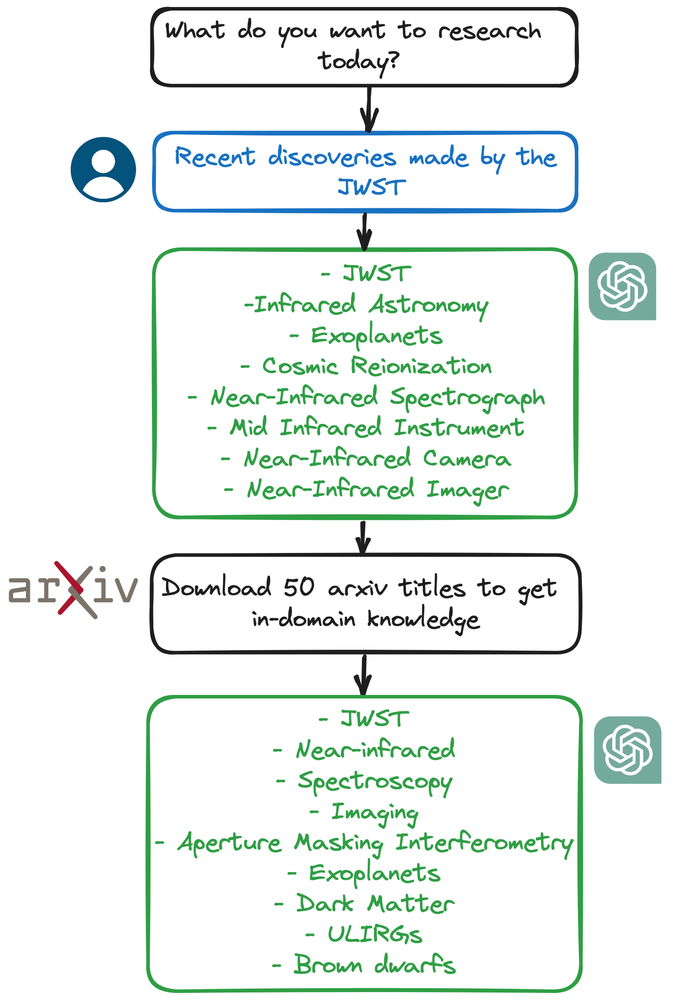
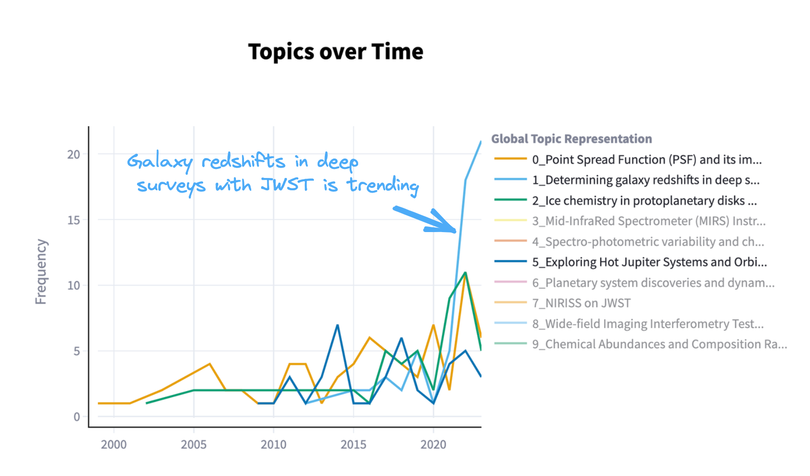

# Research Collections 📖

A Streamlit web app, that leverages the capabilities of Large Language Models (LLMs)
to perform simple reasoning tasks. The app revolves around the concept of
**research collections** which are curated sets of paper metadata obtained from
ArXiv. Users can interact with these collections to explore the research landscape,
identify emerging trends, and receive personalized paper recommendations.

---

## Overview

Make the research process more efficient and enjoyable.
Uses LLMs agents to assist you in finding relevant literature.
The app is divided into four sections:

- **Keyword Generation**: Generate highly relevant keywords for your research.
This is a two-step process. First, an LLM is prompted to generate a
small list of relevant keywords, using its own internal parameters. This list is good,
but tends to be repetitive and usually lacks in-domain knowledge.
To refine the list, the app downloads from ArXiv a small sample of paper titles.
The titles are then fed to the LLM, which uses them to generate a new list of
refined keywords, witch now contain domain-specific knowledge.

<p align="center">
  
</p>

- **Research collections**: Download papers from ArXiv using the refined keywords.
The abstracts are vectorized with the **bge-small-en-v1.5** embedding model
and are stored in a **Milvus** vector database.

<p align="center">
  
</p>

- **Research landscape**: Use BERTopic to identify the underlying topics in your
research collection. Use the powerful visualizations to identify research topics,
outliers, and new trends in the field.

<p align="center">
  
  
</p>

- **Paper Scoring**: Explore your research collections using Retrival Augmented
Generation. Ask questions in natural language and let an LLM identify which
papers are a **must-read**.

<p align="center">
  
</p>


---

## Getting Started

Make sure you have one of the following installed:

- [Poetry](https://python-poetry.org/docs/#installation)
- [Docker](https://docs.docker.com/engine/install/) and [Docker Compose](https://docs.docker.com/compose/install/)

Also, you will need an [OpenAI developer account](https://platform.openai.com/) and an API key.

### Cloning the Repository

1. **Install Milvus**

Follow the instructions to [install Milvus](https://milvus.io/docs/install_standalone-docker.md) and
start the docker container.

2. **Clone the GitHub repository**

```
git clone https://github.com/lgarma/research-assistant.git
```

3. **Set up the virtual environment**

```bash
cd research-assistant
poetry install
poetry shell
```

4. **Set your OpenAI API key**

```bash
echo "OPENAI_API_KEY=your-api-key" > .env
```

5. **Initiate the streamlit app**

```bash
poetry run streamlit run app/01_📖_Research_collection.py
```

### Docker Installation
If you prefer to use Docker, you can set up Research Assistant as follows:

1. **Clone this GitHub repository**

```bash
git clone https://github.com/lgarma/research-assistant.git
```

2. **Set your OpenAI API key**

```bash
echo "OPENAI_API_KEY=your-api-key" > .env
```

3. **Build and run the docker container**

```bash
docker-compose up --build -d
```
